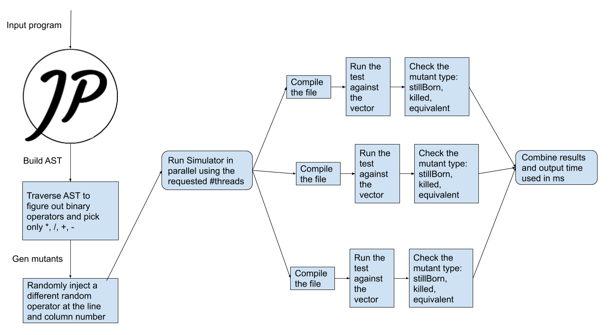

# ECSE-429-PROJECT
ECSE 429 Mutation testing

### Project Description
[Outline](./doc/final_project.pdf)

### Design


### How to Build and run
```
mvn clean compile assembly:single
cd target
java -jar mutantfactory <intputFile> <outputDir> <numberOfMutatns> <#threads>
``` 
